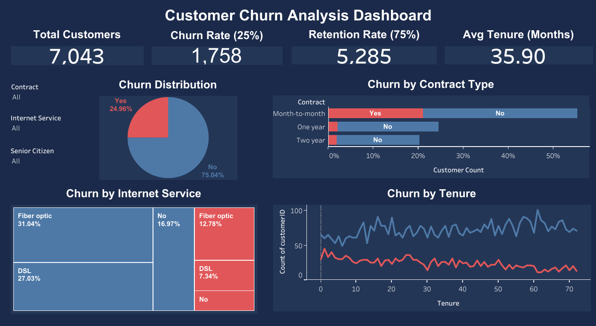

# 📊 Customer Churn Analysis — Telecom Industry



🔗 **[View Live Interactive Dashboard on Tableau Public](https://public.tableau.com/views/CustomerChurnAnalysis_17791337844280/Dashboard1)**

---

## 📌 Problem Statement

Customer churn when a customer stops using a company's service is one of the most critical challenges in the telecom industry. Acquiring a new customer costs **5x more** than retaining an existing one. Even a **5% reduction in churn** can increase profits by 25–95%.

This project answers the key business question:
> **"Which customers are most likely to leave, and what can the business do to retain them?"**

---

## 🎯 Project Objective

- Identify the key factors that drive customer churn
- Analyse customer segments with the highest churn risk
- Provide actionable business recommendations to reduce churn
- Build an interactive dashboard for business stakeholders

---

## 📂 Dataset

| Detail | Info |
|--------|------|
| Source | IBM Telco Customer Churn Dataset |
| Rows | 7,043 customers |
| Columns | 21 features |
| Target Variable | `Churn` (Yes/No) |

**Features include:**
- **Demographics** - Gender, Senior Citizen, Partner, Dependents
- **Services** - Phone, Internet, Streaming, Security, Tech Support
- **Account Info** - Contract type, Payment method, Tenure, Monthly charges

---

## 🛠️ Tools & Technologies

| Tool | Purpose |
|------|---------|
| Python (Google Colab) | Data cleaning & Exploratory Data Analysis |
| Pandas | Data manipulation |
| Matplotlib & Seaborn | Data visualization |
| Tableau Public | Interactive dashboard |
| GitHub | Version control & portfolio |

---

## 🔄 Project Workflow

```
Raw Data → Data Cleaning → Exploratory Analysis → Insights → Dashboard → Recommendations
```

### Phase 1 - Data Understanding
Loaded and inspected the dataset - checked shape, data types, column descriptions, and target variable distribution.

### Phase 2 - Data Cleaning
- Found and fixed **11 missing values** in `TotalCharges` using the formula `Tenure × MonthlyCharges` a logical imputation rather than dropping rows or using mean
- Converted `SeniorCitizen` from 0/1 integer to Yes/No to match other columns
- Verified zero remaining nulls before proceeding to analysis

### Phase 3 - Exploratory Data Analysis
Analysed churn patterns across contract type, tenure, monthly charges, and internet service type using visualizations.

### Phase 4 - Business Insights & Recommendations
Translated data findings into actionable business strategies.

### Phase 5 - Dashboard
Built an interactive Tableau dashboard for stakeholders to explore churn patterns by segment.

---

## 📈 Key Findings

### 1️⃣ Overall Churn Rate - 25%
1 in 4 customers churned. This 75/25 split represents a class imbalance important for any future modelling work.

### 2️⃣ Contract Type is the #1 Churn Driver
| Contract Type | Churn Rate |
|---------------|-----------|
| Month-to-month | **38%** |
| One year | 8.6% |
| Two year | 9.3% |

Month-to-month customers churn at **4x the rate** of annual contract customers. No long-term commitment = easy to leave.

### 3️⃣ New Customers are the Highest Risk
Churn is heavily concentrated in the **first 0–15 months**. After that, customers become significantly more stable. The average tenure of churned customers is 31.3 months vs 37.4 months for retained customers but the histogram tells the real story.

### 4️⃣ Price is NOT the Problem
| Segment | Avg Monthly Charges |
|---------|-------------------|
| Churned | $68.19 |
| Retained | $67.96 |

Almost zero difference. This is a critical negative finding - **lowering prices will NOT fix churn.** The issue is commitment and engagement, not cost.

### 5️⃣ Fiber Optic Customers Churn the Most
Despite being the premium service, fiber optic customers churn at **29%** compared to DSL at 21%. These are tech-savvy customers with high expectations and awareness of competitor offerings.

---

## 💡 Business Recommendations

| Priority | Recommendation | Expected Impact |
|----------|---------------|----------------|
| 🔴 High | Offer discounts or free add-ons to move month-to-month customers to annual contracts | Highest ROI - directly targets #1 churn driver |
| 🔴 High | Launch onboarding program for new customers in first 3–6 months | Reduces early churn significantly |
| 🟡 Medium | Create loyalty program for fiber optic customers with priority support | Retains high-value premium customers |
| 🟡 Medium | Proactive check-ins for customers approaching 12-month mark | Prevents drop-off at key tenure milestone |
| 🟢 Low | Do NOT focus on price cuts as retention strategy | Save budget - price is not the driver |

---

## 🚀 Future Improvements

- Build a **machine learning model** (Logistic Regression, Random Forest) to predict individual churn probability
- Calculate **Customer Lifetime Value (CLV)** to prioritize which customers to retain first
- Add **cohort analysis** to track retention over time
- Connect to **live data** for real-time churn monitoring
- A/B test retention strategies to measure actual impact

---

## 📁 Repository Structure

```
Customer-Churn-Analysis/
│
├── Customer_Churn_Analysis.ipynb   # Main Python notebook
├── telco_churn.csv                 # Raw dataset
├── telco_churn_clean.csv           # Cleaned dataset
├── churn_insights_report.txt       # Business insights report
├── dashboard.png                   # Dashboard screenshot
└── README.md                       # Project documentation
```

---

## 📬 Connect With Me

**Abhinandan Sonne**
- 🔗 LinkedIn: [Abhinandan Sonne](https://www.linkedin.com/in/abhinandan-sonne)
- 💻 GitHub: [https://github.com/Abhisonne](https://github.com/Abhisonne)

---

*This project was built as part of my Data/Business Analyst portfolio to demonstrate end-to-end analytical thinking from raw data to business recommendations.*
